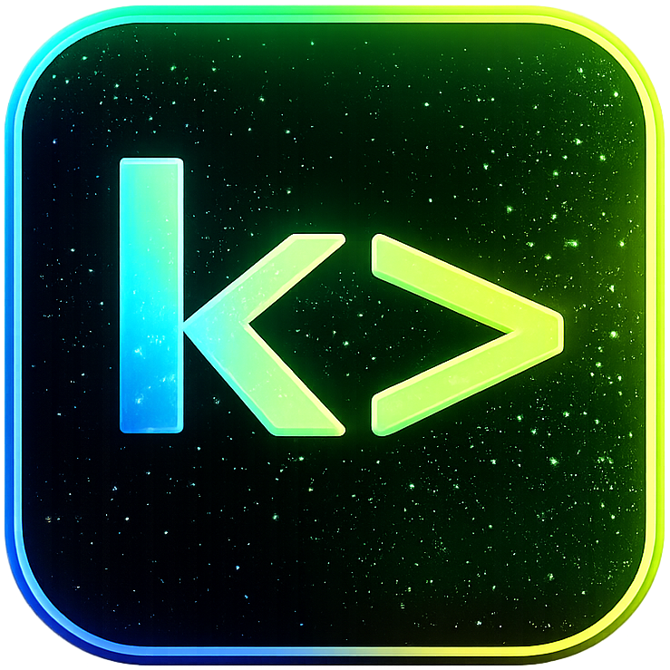
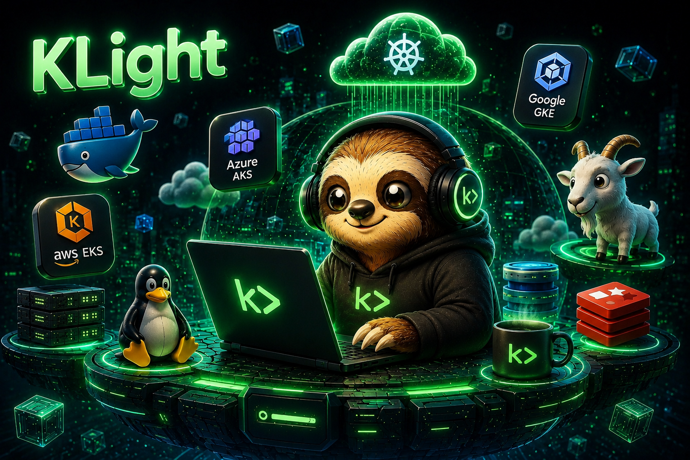
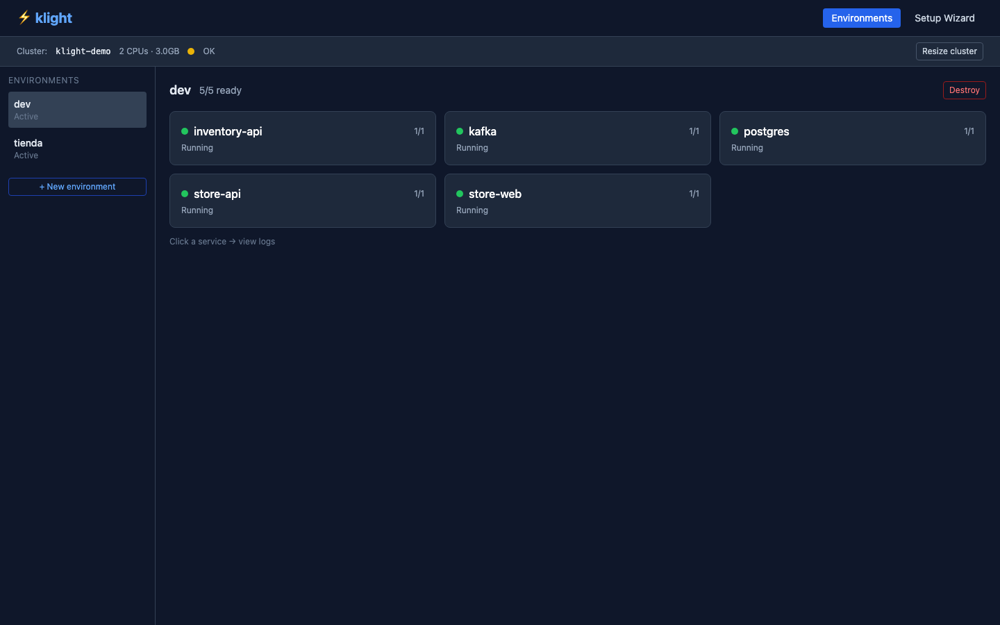
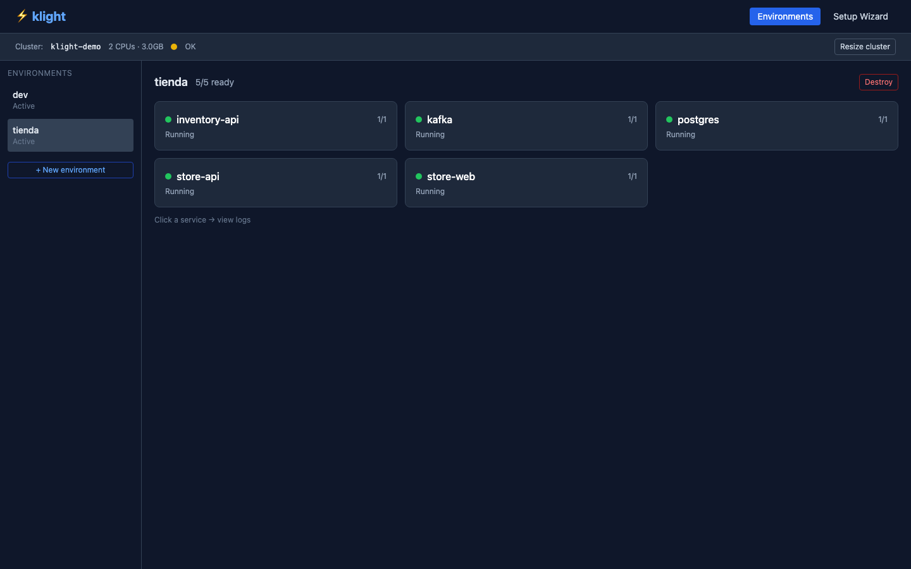
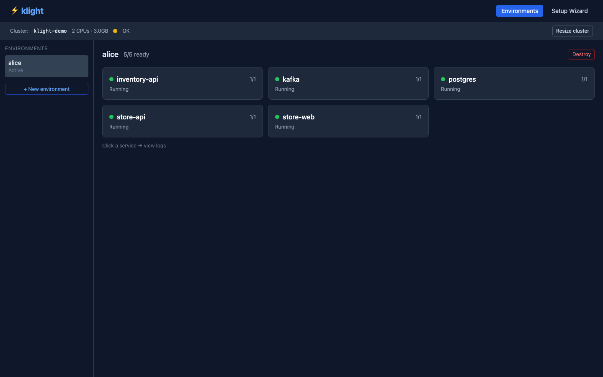
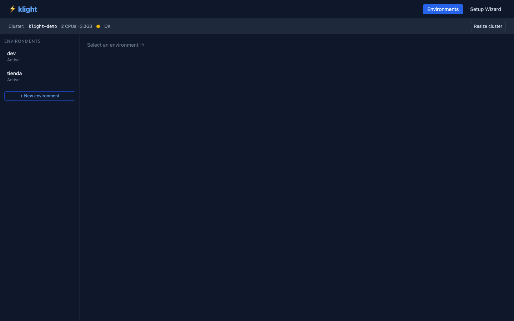
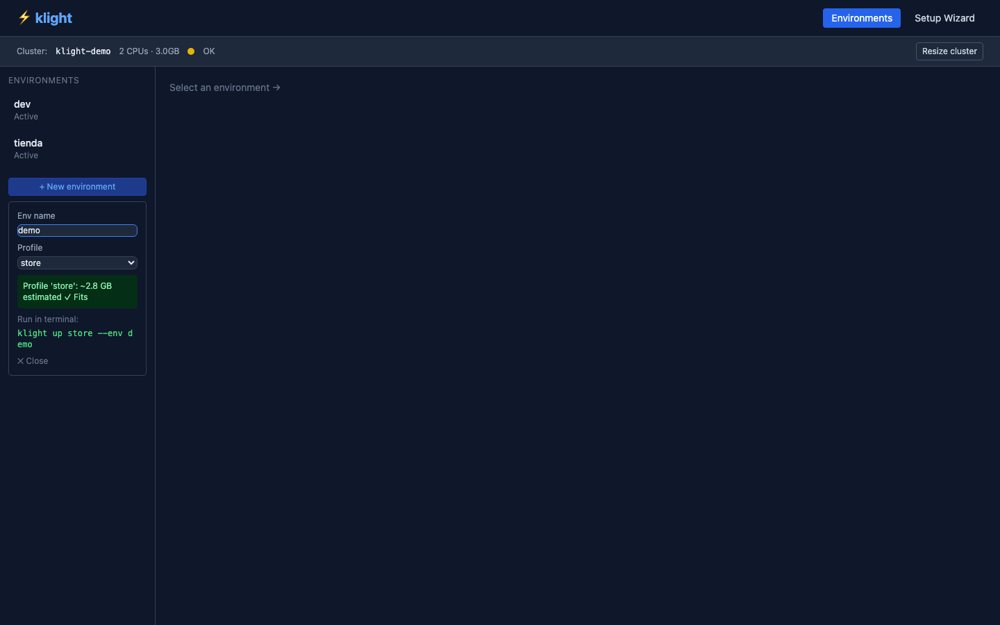
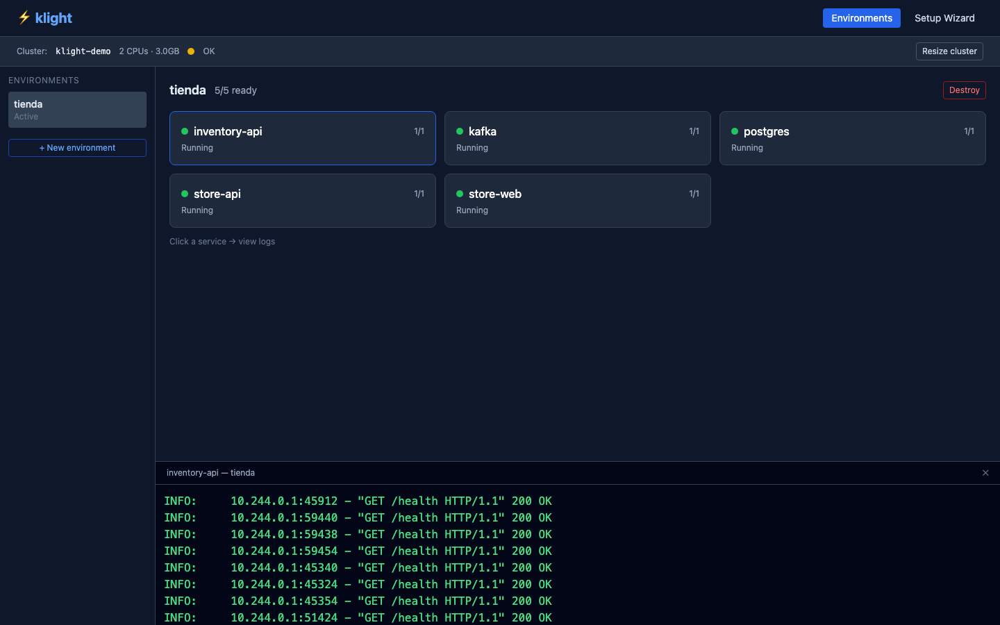
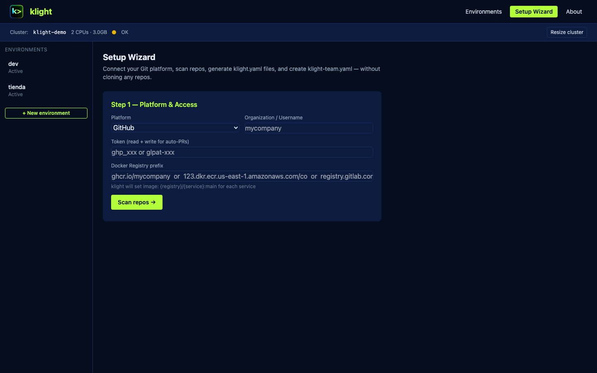

#  klight

> Run your full microservices stack locally — or on a shared cloud cluster — with two commands.



klight gives every developer an isolated, full-stack environment without knowing Kubernetes exists. One command brings up databases, message brokers, and all your services in the right order. Another tears everything down.

---

## Three scenarios

### Scenario 1 — Solo dev, local code

You have the code. No CI pipeline. You want a real stack, not Docker Compose hacks.

```bash
klight local setup                                          # start minikube (once)
klight local build-load inventory-api --path ./inventory-api
klight local build-load store-api     --path ./store-api
klight local build-load store-web     --path ./store-web
klight from-repos ./inventory-api ./store-api ./store-web --env dev
klight replace store-api --with ./store-api --env dev       # edit → rebuild → hot-swap
```



### Scenario 2 — Team, sync from Git (no local clones)

New team member. You don't clone any service repo. The stack runs from CI images.

```bash
klight sync https://raw.githubusercontent.com/your-org/infra/main/klight-team.yaml
klight up store --env alice                                 # postgres + kafka + 3 services
```



### Scenario 3 — Remote cluster (EKS, GKE, AKS)

Team outgrew local minikube. DevOps runs one command; devs connect with a token.

```bash
# DevOps (once, on the remote cluster):
klight cluster setup-remote                                 # creates SA + RBAC + prints token

# Dev (once per laptop):
klight connect --url https://cluster.company.com --token eyJ...
klight use klight-remote
klight up store --env alice                                 # same commands, cloud cluster
```



---

## The UI

`klight ui` opens a dashboard at `http://localhost:7700`. It follows whatever cluster is active.

**Cluster status bar** — always shows where you're running and how much RAM is available:



**Smart sizing** — before you deploy, klight estimates memory needs for your profile and warns you before pods get OOMKilled:



**Live logs** — click any service card to see real-time logs:



**Setup Wizard** — for DevOps: connect your Git platform, scan repos, generate `klight.yaml` files, and create `klight-team.yaml` without cloning anything:



---

## How it works

### The `klight.yaml` (add one to each service repo)

```yaml
# yaml-language-server: $schema=https://slothlabsorg.github.io/klight/schema/klight.yaml.json
name: inventory-api
port: 8081
health: /health

needs: [postgres, kafka]        # klight starts these, waits for them, wires up env vars

migration:
  command: ["python", "-m", "app.migrate"]   # runs as a Job before the service starts

env:                            # exact var names your code already reads
  DB_HOST: postgres
  DB_NAME: inventory_db
  KAFKA_BOOTSTRAP_SERVERS: kafka:9092
```

That's it. Zero changes to application code. No Kubernetes YAML to write.

### The `klight-team.yaml` (DevOps puts this in the infra repo)

```yaml
version: "1"
team: my-company

source:
  type: git
  url: https://github.com/my-company/infra
  branch: main

services:
  - name: store-api
    image: ghcr.io/my-company/store-api:main        # registry-agnostic: ECR, GCR, GHCR
    repo: https://github.com/my-company/store-api
  - name: inventory-api
    image: ghcr.io/my-company/inventory-api:main
    repo: https://github.com/my-company/inventory-api

profiles:
  store: [inventory-api, store-api, store-web]      # groups of services to deploy together
  full:  [inventory-api, store-api, store-web, sales-recorder]
```

Developers run `klight sync <url>` once and get the full team configuration cached locally. After that `klight up store --env alice` works without cloning any service repo.

### What klight does when you run `klight up`

```
your cluster
└── namespace: env-alice          ← isolated, created fresh

    ┌─ postgres StatefulSet       ← starts first (needs: [postgres])
    ├─ kafka StatefulSet          ← starts first (needs: [kafka])
    │
    ├─ inventory-api-migrate Job  ← runs after postgres is ready
    │
    ├─ inventory-api Deployment   ← sentinel init container waits for postgres + kafka
    ├─ store-api Deployment       ← same: waits for its dependencies
    └─ store-web Deployment       ← starts after store-api is healthy
```

Each service gets a configmap with its env vars, a ClusterIP service for DNS discovery, and a `sentinel` init container that blocks startup until its dependencies are healthy. You never write any of this — klight generates it from `klight.yaml`.

---

## Built-in infrastructure catalog

Add any of these to `needs:` in your `klight.yaml`:

| Name | Image | What it provides |
|------|-------|-----------------|
| `postgres` | postgres:16-alpine | `DB_HOST`, `DB_PORT` |
| `kafka` | apache/kafka:3.7.0 | `KAFKA_BOOTSTRAP_SERVERS` |
| `redis` | redis:7-alpine | `REDIS_HOST`, `REDIS_PORT` |
| `mongodb` | mongo:7 | `MONGODB_URI` |
| `rabbitmq` | rabbitmq:3-management | `RABBITMQ_URL` |
| `localstack` | localstack/localstack:3 | `AWS_ENDPOINT_URL`, `AWS_*` |
| `elasticsearch` | elasticsearch:8 | `ELASTICSEARCH_URL` |

Add your own in `klight-catalog.yaml` at your project root — no changes to klight needed.

---

## Developer reference

### Local cluster

```bash
klight local setup                               # start minikube klight-demo (2 CPUs, 3 GB)
klight local setup --cpus 4 --memory 6144        # larger cluster for heavy profiles
klight local resize --memory 4096               # resize without destroying data
klight local build-load <svc> --path <dir>       # docker build + minikube image load
klight local status                              # show cluster status + loaded images
```

### Environments

```bash
klight up <profile> --env <name>                 # create namespace + deploy full profile
klight ps --env <name>                           # pod status table
klight logs <svc> --env <name>                   # tail logs
klight logs <svc> --env <name> -c sentinel       # see what an init container is waiting for
klight open <svc> --env <name>                   # port-forward + open browser
klight exec <svc> --env <name> -- sh             # shell into running pod
klight replace <svc> --with <dir> --env <name>   # hot-swap with local build
klight destroy <name>                            # delete namespace + everything in it
```

### Team sync

```bash
klight sync <url>                                # download klight-team.yaml + cache configs
```

### Cluster targets

```bash
klight use local                                 # switch to minikube klight-demo
klight use remote                                # switch to configured remote cluster
klight target                                    # show current target
klight connect --url <u> --token <t>             # register remote cluster
klight connect --kubeconfig <path>               # import kubeconfig (kubeconfig path)
```

### Remote cluster setup (DevOps)

```bash
# Run on the remote cluster (needs cluster-admin):
klight cluster setup-remote
# Creates:
#   Namespace: klight-system
#   ServiceAccount: klight-dev
#   ClusterRole: create/delete env-* namespaces + full access inside them
#   ClusterRoleBinding: klight-dev
#   Token: valid 1 year → share with devs via klight connect
```

### UI

```bash
klight ui                                        # http://localhost:7700
```

---

## DevOps guide — setting up a team

### Step 1: Add `klight.yaml` to each service repo

Each service gets a `klight.yaml` at the repo root. Use the Setup Wizard (`klight ui` → Setup Wizard tab) to scan your org and generate these automatically, or write them manually. A minimal one takes 5 minutes.

### Step 2: Create `klight-team.yaml` in your infra repo

The team config lives in your central infra/platform repo. It lists services, their CI images, and how they're grouped into profiles. The Setup Wizard generates this for you.

### Step 3: Configure remote access (optional, for shared cluster)

```bash
kubectl config use-context your-cluster
klight cluster setup-remote
```

Copy the printed `klight connect ...` command into your onboarding docs or Slack.

### Step 4: Onboard a new developer

Share one URL:
```
klight sync https://raw.githubusercontent.com/your-org/infra/main/klight-team.yaml
```

That's the entire onboarding doc.

---

## How is this different from Docker Compose?

| | Docker Compose | klight |
|---|---|---|
| Isolation | Shared network, shared volumes | Each dev gets their own namespace |
| Multiple envs on one machine | Manual port conflicts | `env-alice`, `env-bob`, `env-pr-123` all coexist |
| Production parity | Docker containers only | Real Kubernetes — matches staging/prod |
| CI/PR environments | Manual setup | `klight up <profile> --env pr-123` in CI |
| Existing K8s manifests | Not supported | `manifest: ./deploy/overlays/dev` in klight.yaml |
| Startup ordering | `depends_on` (process-level) | `sentinel` init container (pod-level, same as prod) |
| Remote cluster | Not supported | `klight use remote` → same commands |
| Team config | Each dev maintains their own | Sync from central `klight-team.yaml` |

---

## Repository layout

```
klight/          Python CLI package (pip install klight)
klight-ui/       FastAPI dashboard server + Playwright tests
manifests/       K8s templates for infrastructure + service scaffold
sentinel/        busybox init container for startup ordering
examples/        Working examples: tienda demo, company-infra structure
docs/            In-depth guides for each feature area
WORKSHOP.md      Video scripts for World 1, 2, 3 with speech + screen actions
```

---

## Quick start

```bash
pip install klight

# Option A: local dev (you have the code)
klight local setup
klight local build-load my-api --path ./my-api
klight up my-profile --env dev

# Option B: team sync (no local repos needed)
klight sync https://raw.githubusercontent.com/your-org/infra/main/klight-team.yaml
klight up store --env alice

# Open the UI
klight ui
```

For a walkthrough of all three scenarios with screenshots and speech scripts, see [WORKSHOP.md](WORKSHOP.md).
