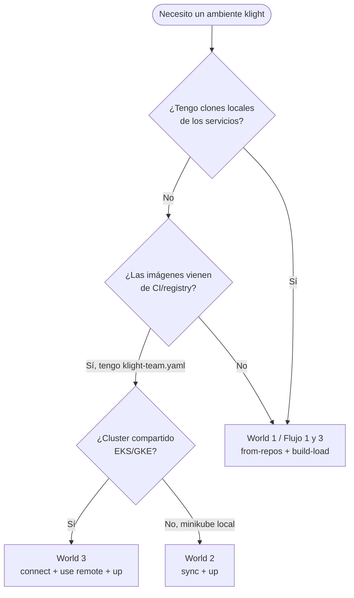
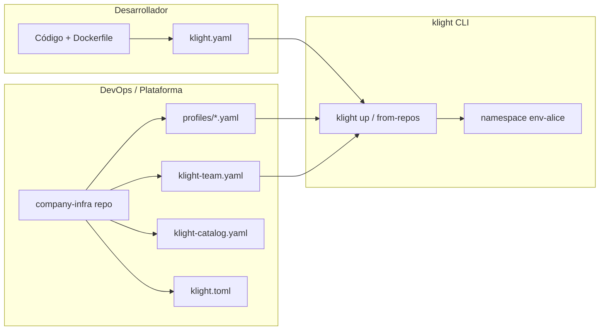
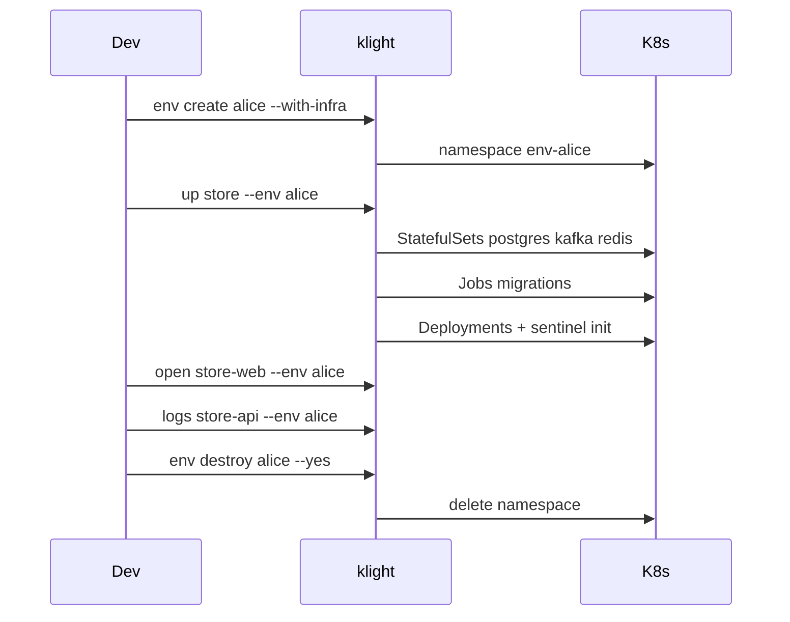

# Manual de referencia klight — por rol

Índice maestro para desarrolladores, DevOps y tech leads. Los detalles están en los docs numerados de este repositorio; este manual organiza **qué hacer según tu rol** y **qué escenario usar**.

**Repos:**

| Repo | Contenido |
|------|-----------|
| [kraken-light](https://github.com/slothlabsorg/kraken-light) | CLI, UI, manifests, documentación |
| [klight-suite-test](https://github.com/slothlabsorg/klight-suite-test) | TiendaDemo — app de prueba + checklist |

---

## Workshops por rol (demos ejecutables)

Tres workshops autocontenidos en [`klight-suite-test/demos/`](https://github.com/slothlabsorg/klight-suite-test/blob/main/demos/README.md), cada uno con un **stack y un flujo distintos** (corren en modo mock, sin cuentas reales de terceros):

| Demo | Rol | Stack | Externos (mock) | Flujo |
|------|-----|-------|-----------------|-------|
| [dev-students](https://github.com/slothlabsorg/klight-suite-test/blob/main/demos/dev-students/WORKSHOP.md) | Desarrollador | Python + Node + React | Auth0 | World 1 — `from-repos` |
| [devops-todo](https://github.com/slothlabsorg/klight-suite-test/blob/main/demos/devops-todo/WORKSHOP.md) | DevOps | Go + Python + React + Kafka | SendGrid + Twilio | World 2/3 — `sync` sin clonar |
| [techlead-dropship](https://github.com/slothlabsorg/klight-suite-test/blob/main/demos/techlead-dropship/WORKSHOP.md) | Tech lead | Rust gRPC + GraphQL + React | Amazon SP-API | Polyglot — `build:` custom |

### Asistente web "Get started"

```bash
klight ui   # http://localhost:7700 → pestaña Get started
```

Te pregunta **qué eres**, **si tienes acceso a un cluster** y **si eres DevOps**, detecta tu entorno (kubectl, minikube, `klight-team.yaml`) y te lleva al workshop + comandos correctos. Sin saber Kubernetes.

---

## ¿Qué escenario uso?



| Escenario | Quién | Comandos clave | Artefactos |
|-----------|-------|----------------|------------|
| **World 1** — Solo dev, código local | Desarrollador | `local build-load`, `from-repos`, `replace`, `watch` | `klight.yaml` por servicio |
| **World 2** — Equipo, sin clones | Dev + DevOps | `sync`, `up <profile>` | `klight-team.yaml`, profiles |
| **World 3** — Cluster remoto | DevOps configura; dev usa | `cluster setup-remote`, `connect`, `use remote` | RBAC, token, `klight.toml` |

Mapeo con [PERSONAS.md](https://github.com/slothlabsorg/klight-suite-test/blob/main/docs/PERSONAS.md) del suite-test:

- **Flujo 1** (zero config) ≈ World 1 + `klight init`
- **Flujo 2** (infra centralizada) ≈ World 2 + `company-infra/`
- **Flujo 3** (klight.yaml por repo) ≈ World 1 con repos propios

---

## Diagrama: roles y artefactos



---

## Diagrama: ciclo de vida de un ambiente



---

## Rol: Desarrollador

### Primer día (World 1)

```bash
export KUBECONFIG=/tmp/klight-demo-kubeconfig.yaml   # si tenés otros contextos kubectl

pip install -e /path/to/kraken-light/klight
klight local setup
klight local build-load store-api     --path ./services/store-api
klight local build-load inventory-api --path ./services/inventory-api
klight local build-load store-web     --path ./services/store-web

klight from-repos ./inventory-api ./store-api ./store-web --env dev
klight ui
klight open store-web --env dev
```

Si no tenés `klight.yaml`:

```bash
klight init --path ./my-service
```

### Día a día

| Tarea | Comando |
|-------|---------|
| Ver pods | `klight ps --env dev` |
| Ver qué no está listo | `klight unready --env dev` |
| Logs | `klight logs store-api --env dev` |
| Abrir UI del servicio | `klight open store-web --env dev` |
| Hot-swap tras editar código | `klight replace store-api --with ./store-api --env dev` |
| Live reload | `klight watch store-api --env dev` |
| Query DB | `klight db query --env dev --db store_db "SELECT ..."` |
| Migración | `klight db migrate store-api-v2 --env dev` |
| Destruir ambiente | `klight env destroy dev --yes` |

### Mantener `klight.yaml`

El dev escribe **los mismos nombres de env vars** que su código ya lee:

```yaml
name: store-api
port: 8080
needs: [postgres, kafka]
depends: [inventory-api:8081/health]
env:
  DB_HOST: postgres
  INVENTORY_API_URL: http://inventory-api:8081
```

### Secrets de SaaS externos (por-servicio)

Para credenciales de terceros (Auth0, Twilio, Amazon…) declara las **claves** en `klight.yaml` y pon los **valores** con el CLI (nunca en el YAML). klight las materializa en un Secret propio del servicio (`<name>-secrets`), no en el secret global ni en un ConfigMap. Sin valores, el servicio corre en modo mock.

```yaml
# klight.yaml
secrets:
  - AUTH0_CLIENT_SECRET
```

```bash
klight secrets set students-api AUTH0_CLIENT_SECRET=xyz --env dev
klight secrets list students-api --env dev
klight replace students-api --with ./students-api --env dev   # aplicar al pod
```

Docs: [03-getting-started](03-getting-started.md), [05-adding-a-service](05-adding-a-service.md), [08-service-dependencies](08-service-dependencies.md), [11-cli-reference](11-cli-reference.md)

### Laboratorio TiendaDemo

Seguir [SETUP](https://github.com/slothlabsorg/klight-suite-test/blob/main/docs/SETUP.md) y [CHECKLIST](https://github.com/slothlabsorg/klight-suite-test/blob/main/docs/CHECKLIST.md) (18 puntos).

---

## Rol: DevOps / Plataforma

### Setup inicial del equipo

1. Crear repo `company-infra/` (ver [examples/company-infra/](../examples/company-infra/))
2. Definir `klight.toml` — targets local y remote
3. Crear profiles con `includes:` para verticales
4. Publicar `klight-team.yaml` — un URL para todos los devs
5. Opcional: `klight-catalog.yaml` para infra custom → [12-custom-catalog](12-custom-catalog.md)

```bash
# DevOps en cluster remoto (una vez)
klight cluster setup-remote
# → imprime token + instrucciones

# Dev nuevo
klight sync https://raw.githubusercontent.com/org/infra/main/klight-team.yaml
klight up vertical1 --env alice
```

### Setup Wizard (UI)

```bash
klight ui   # http://localhost:7700 → tab Setup Wizard
```

Escanea repos, detecta `klight.yaml`, flaggea `needs:` faltantes en catálogo, genera `klight-team.yaml`.

Docs: [13-devops-team-setup](13-devops-team-setup.md), [14-local-vs-remote](14-local-vs-remote.md), [15-vision-setup-wizard](15-vision-setup-wizard.md), [10-ci-cd-integration](10-ci-cd-integration.md)

### World 2 — sin clones locales

```bash
klight sync <klight-team.yaml URL>
klight up store --env tienda
klight ps --env tienda
```

Imágenes vienen del registry (GHCR/ECR). En local, `imagePullPolicy: Never` requiere `build-load` previo.

### World 3 — cluster compartido

```bash
klight connect --url https://k8s.dev.company.com --token <token>
klight use remote
klight target
klight up store --env alice
```

Mismos comandos que local; solo cambia el target.

---

## Rol: Tech lead / Founder

| Decisión | Recomendación |
|----------|----------------|
| ¿Empezar con wizard o manual? | Wizard si tenés GitHub org; manual si monorepo pequeño |
| ¿Un postgres o varios? | Uno por namespace (built-in `postgres`) salvo requisito fuerte de aislamiento |
| ¿Profile rico o repos? | &lt;10 devs: `klight.yaml` por repo. Con DevOps: profiles + CI images |
| Onboarding nuevo dev | Un URL: `klight sync` + `klight up` |

---

## Tabla rápida: comandos por rol

| Comando | Dev | DevOps | Tech lead |
|---------|:---:|:------:|:---------:|
| `klight init` | ✅ | | |
| `from-repos` / `replace` / `watch` | ✅ | | |
| `klight up` / `env destroy` | ✅ | ✅ | |
| `klight secrets set` (por-servicio) | ✅ | ✅ | ✅ |
| `klight sync` | ✅ | ✅ | ✅ |
| `cluster setup-remote` | | ✅ | |
| `klight connect` / `use` | ✅ | ✅ | |
| Setup Wizard (`klight ui`) | | ✅ | ✅ |
| `klight-catalog.yaml` | | ✅ | |

---

## Troubleshooting común

| Síntoma | Causa probable | Solución |
|---------|----------------|----------|
| Deploy en cluster equivocado | Múltiples contextos kubectl | `export KUBECONFIG=/tmp/klight-demo-kubeconfig.yaml` |
| ImagePullBackOff | Imagen no en minikube | `klight local build-load <svc> --path ...` |
| OOMKilled | minikube chico | `klight local resize --memory 6144` |
| `Unknown infra: X` | Falta catálogo custom | [12-custom-catalog](12-custom-catalog.md) |
| Sentinel stuck | Dep no healthy | `klight logs <svc> -c sentinel --env X` |
| Warning prod context | Contexto parece producción | Confirmar o `klight use local` |

---

## Verificación y tests

| Doc | Contenido |
|-----|-----------|
| [TEST-MATRIX](https://github.com/slothlabsorg/klight-suite-test/blob/main/docs/TEST-MATRIX.md) | Matriz por escenario/rol |
| [CHECKLIST](https://github.com/slothlabsorg/klight-suite-test/blob/main/docs/CHECKLIST.md) | 18 puntos TiendaDemo |
| [ARCHITECTURE](https://github.com/slothlabsorg/klight-suite-test/blob/main/docs/ARCHITECTURE.md) | Diagramas TiendaDemo |

**Tests automatizados (kraken-light):**

```bash
cd kraken-light/klight && pip install -e ".[dev]"
python -m pytest tests/ -m "not integration" -v
# Con minikube:
KUBECONFIG=/tmp/klight-demo-kubeconfig.yaml python -m pytest tests/ -m integration -v
```

---

## Índice de documentación

| # | Doc | Tema |
|---|-----|------|
| 00 | Este manual | Por rol |
| 01 | [overview](01-overview.md) | Introducción |
| 02 | [core-concepts](02-core-concepts.md) | Conceptos |
| 03 | [getting-started](03-getting-started.md) | Primeros pasos |
| 04–11 | lifecycle, services, DB, secrets, deps, profiles, CI, CLI | Referencia |
| 12 | [custom-catalog](12-custom-catalog.md) | Infra custom |
| 13–16 | DevOps, local/remote, wizard, MCP | Equipo |

Más diagramas: [docs/diagrams/scenarios.md](diagrams/scenarios.md)
