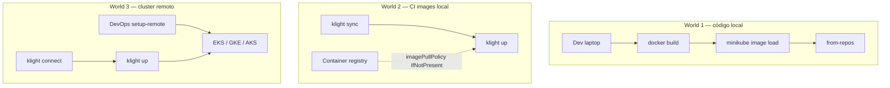
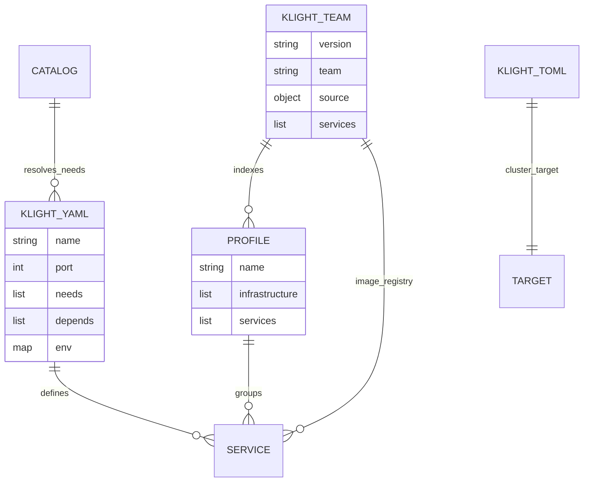
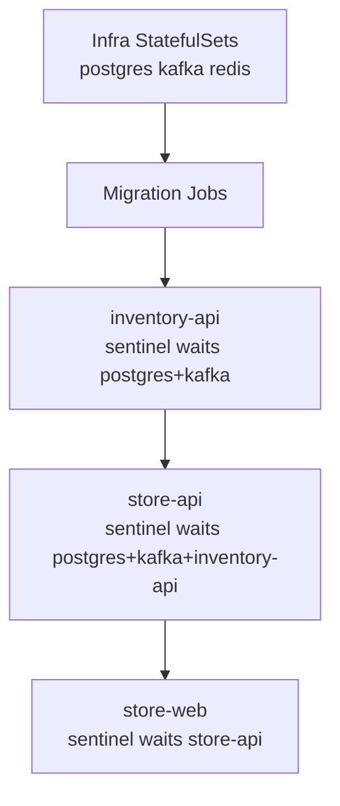

# Diagramas klight — escenarios y plataforma

Complemento visual de [00-manual-por-rol.md](../00-manual-por-rol.md) y [ARCHITECTURE.md](../../ARCHITECTURE.md).

---

## World 1 vs 2 vs 3 — flujo de imágenes

---

## Artefactos y responsabilidades

---

## Sentinel y orden de arranque

---

## TiendaDemo — topología (referencia)

Ver diagramas detallados en [klight-suite-test/docs/ARCHITECTURE.md](https://github.com/slothlabsorg/klight-suite-test/blob/main/docs/ARCHITECTURE.md):

1. Servicios dentro del namespace
2. Secuencia de una venta
3. Workflow del desarrollador con klight
4. Local vs EKS
5. Scope cluster vs namespace

---

## Perfiles TiendaDemo

| Profile | Servicios | Uso |
|---------|-----------|-----|
| `store` | inventory-api, store-api, store-web | Checklist 18 puntos |
| `store-extended` | + billing-service, sales-recorder, localstack | Demo Kotlin + manifest: |
